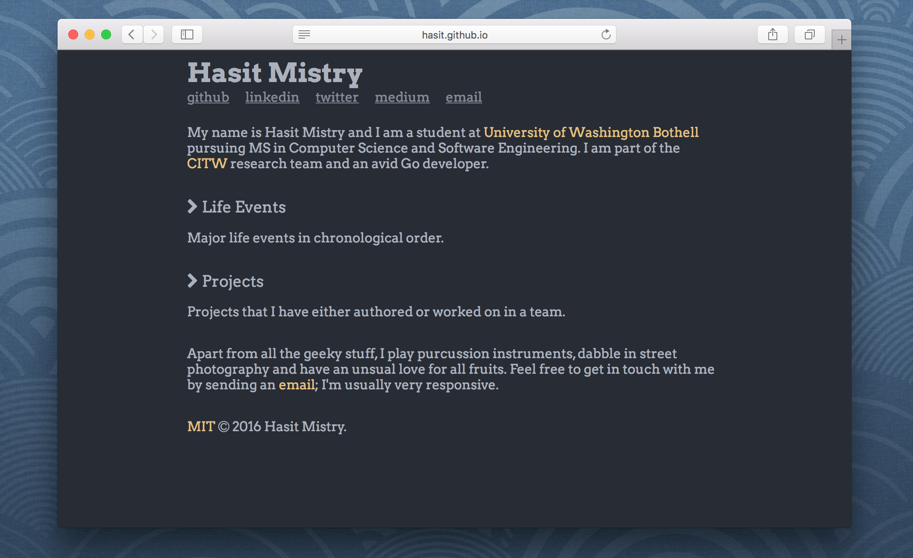
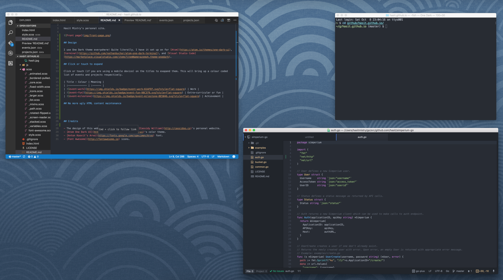

# [hasit.github.io](http://hasit.github.io)

Hasit Mistry's personal site.



## Design

The design of this website is heavily inspired by [Cassidy William](http://cassidoo.co)'s personal website.

I use One Dark theme everywhere! Quite literally. I have it set up on for [Atom](https://atom.io/themes/one-dark-ui), [Terminal](https://github.com/nathanbuchar/atom-one-dark-terminal), and [Visual Studio Code](https://marketplace.visualstudio.com/items?itemName=azemoh.theme-onedark).



So using One Dark color scheme for my personal website as well was an obvious choice for me. It is actually very easy to find the hex values of the colors. All you have to do is open any One Dark package/extension/theme (out of the 5 million) and copy the colors. I got mine from an [Emacs theme]((https://github.com/jonathanchu/atom-one-dark-theme)). Here are the colors for convenience sake.

| Color identifier | Hex |
| :--------------- | :-- |
| atom-one-dark-accent | #528BFF |
| atom-one-dark-fg | #ABB2BF |
| atom-one-dark-bg | #282C34 |
| atom-one-dark-bg-1 | #121417 |
| atom-one-dark-bg-hl | #2F343D |
| atom-one-dark-mono-1 | #ABB2BF |
| atom-one-dark-mono-2 | #828997 |
| atom-one-dark-mono-3 | #5C6370 |
| atom-one-dark-cyan | #56B6C2 |
| atom-one-dark-blue | #61AFEF |
| atom-one-dark-purple | #C678DD |
| atom-one-dark-green | #98C379 |
| atom-one-dark-red-1 | #E06C75 |
| atom-one-dark-red-2 | #BE5046 |
| atom-one-dark-orange-1 | #D19A66 |
| atom-one-dark-orange-2 | #E5C07B |
| atom-one-dark-gray | #3E4451 |
| atom-one-dark-silver | #AAAAAA |
| atom-one-dark-black | #0F1011 |

I've used [Sass](http://sass-lang.com) as the CSS preprocessor, [Anton Koovit's Arvo](https://fonts.google.com/specimen/Arvo) font, and [Font Awesome](http://fontawesome.io) icons.

## Click or touch to expand titles

Click or touch (if you are using a mobile device) on the titles to exapand them. This will bring up a color coded list of events and projects respectively. Here is what the colors mean.

| Title - color | Meaning |
| :------------- | :------ |
|  | Work |
|  | Extra-curricular or fun |
|  | Milestone or achievement |

## No more ugly HTML content maintenance

One again, I got this idea from [Cassidy William](http://cassidoo.co)'s personal website.

I see myself using this design and format for a long period of time. So it only made sense to keep the `index.html` file simple and clean. For this reason, I decided to save all my life events and project data in JSON format in the `data/` folder. Now fetching this data is as simple as calling a function using [Github's Fetch](https://github.github.io/fetch/) library.

```javascript
function pullData(file) {
  return fetch('./data/' + file + '.json', buildHeader()).then(function (response) {
    return response.json();
  });
}
```

Once the data is fetched, you can do all kinds of fun stuff with it. Organize it however you want. I have added it to a list.

```javascript
function events() {
  var h = document.getElementById('events');
  pullData('events').then(function (r) {
    for (var i = 0, len = r.data.length; i < len; i++) {
      var x = r.data[i];
      h.innerHTML += '<li><div class="date">' + x.date + '</div><div class="desc"><div>' + x.description.what + ' <span class=' + x.type + '>' + x.description.who + '</span></div><div class="info">' + x.description.info + '</div></div></li>';
    }
  });
}
```

## Contributing and using.

Feel free to ask questions, post issues and open pull requests. This website is licensed under [MIT](https://github.com/hasit/hasit.github.io/blob/master/LICENSE) so do not feel shy to use it for your own projects.